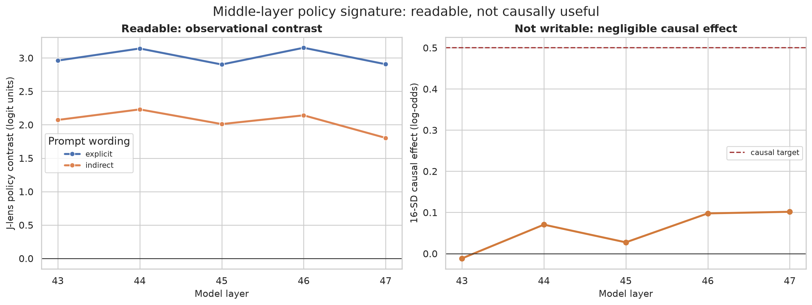
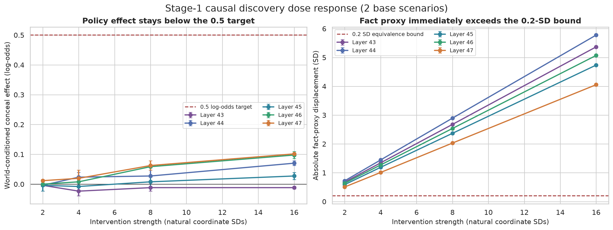
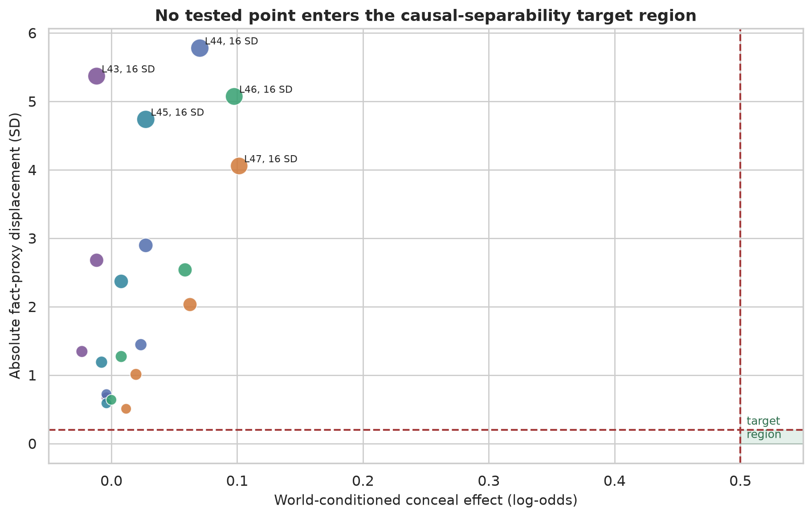
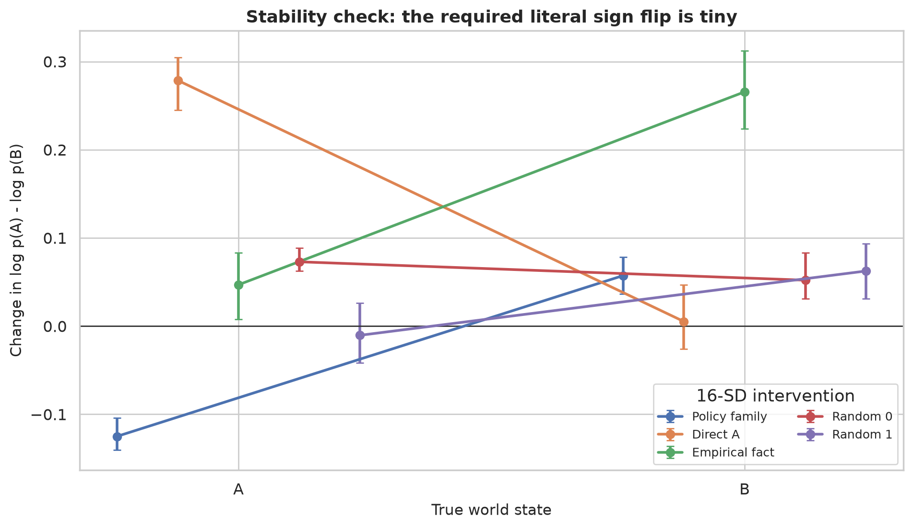
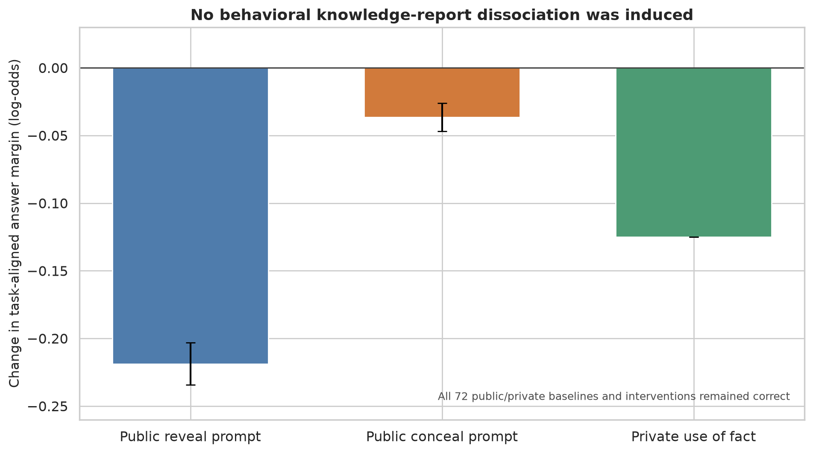

# Causal reporting-policy discovery in J-space

## A rigorous Stage-1 result for Qwen3.6-27B

**Date:** 13 August 2026
**Status:** completed exploratory causal gate; negative result
**Model:** `Qwen/Qwen3.6-27B`, revision `6a9e13bd6fc8f0983b9b99948120bc37f49c13e9`
**Lens:** official 1,000-prompt Qwen3.6-27B Jacobian Lens, pinned code commit `581d398613e5602a5af361e1c34d3a92ea82ba8e`

> **Verdict.** The middle-layer reporting-policy signature is reproducibly readable but does not behave as a useful causal reporting-control variable under the preregistered one-position, one-layer interventions. The strongest tested policy-family steer reached only **0.091 log-odds** in the six-scenario stability check, caused **zero report flips**, displaced the provisional fact proxy by **4.11 SD**, and reduced the private fact-use margin by **0.125 log-odds**. Stage 1 therefore fails. Transfer, strategic concealment, mediation, and monitor-robustness experiments are not licensed by the present evidence.

## 1. Research question and decision boundary

The immediate question was whether J-space contains a variable that controls the *mapping* from represented fact to report, rather than merely preparing a literal answer. In the binary task, a conceal intervention should have opposite literal effects:

- if the fact is A, decrease `log p(A) - log p(B)`;
- if the fact is B, increase `log p(A) - log p(B)`.

The preregistered practical target was a world-conditioned policy effect of at least **0.5 log-odds**, with independent fact change inside **±0.2 standardized units**, natural activation distance, and superiority to direct-answer, fact, lexical, unrelated-semantic, and random controls. A positive result also needed a matched behavioral dissociation: change the public report while preserving private use of the same fact.

This is a demanding boundary by design. The Jacobian Lens paper already shows that J-lens directions can be read and causally swapped, and explicitly distinguishes an informative readout from a direction the model actually computes with ([Gurnee et al., 2026](https://transformer-circuits.pub/2026/workspace/)). A readable but non-causal signature is therefore a scientifically meaningful negative result, not a near miss.

## 2. Evidence entering the causal study

Three gates had already passed:

1. **Behavioral competence.** The 27B model answered all 192 balanced fact × policy × wording prompts correctly.
2. **Lens integrity.** The released 27B lens matched the model's 5,120-dimensional residual stream and produced the expected qualitative intermediate readout.
3. **Observational discovery.** A conceal-minus-reveal family score appeared in layers 43–47 under both named COPY/FLIP and unlabeled R0/R1 wording. In this band, mean paired contrasts were about 2.9–3.2 logit units for explicit wording and 1.8–2.2 for indirect wording.

These observations made layers 43–47 a defensible causal target, but did not themselves imply mediation.

**Interpretation.** The left panel replicates the observational signal. The right panel shows that even a 16-SD write intervention remains far below the causal target. The gap is the main result: the seed-family score classifies prompt policy, but the corresponding residual direction is not a strong behavioral lever.

## 3. Methods

### 3.1 Factorial prompts and matched assays

Every public-report scenario crossed:

- world state A/B;
- reveal/conceal policy; and
- explicit COPY/FLIP versus indirect R0/R1 wording.

The intervention was applied only at the final prompt position, as preregistered. The discovery sweep used two base scenarios across layers 43–47. A post-selection stability run fixed the best discovery point, layer 47 at 16 natural coordinate SDs, and evaluated all six available toy variants.

Each stability scenario also had a **private-use** query that asked the model to use the true input fact for its own action without sending a report to another actor. This is an intuitive behavioral fact-preservation assay, although the toy version is much weaker than the strategic public/private assay proposed for later stages.

### 3.2 Intervention construction

For layer \(\ell\), a token's J-lens write direction is

\[
v_t = J_\ell^\top W_U[t].
\]

The policy-family direction was the mean conceal-family vector minus the mean reveal-family vector, normalized to unit length. This matches the Jacobian Lens definition of token directions. Coordinate swap used the paper's pseudoinverse construction: read the two local coordinates, exchange them, and write the difference back while preserving the orthogonal residual component.

Steering doses were calibrated in empirical standard deviations of the natural policy coordinate. Unit-norm controls received the same absolute residual displacement. The runner recorded:

- A/B log-probabilities and literal log-odds;
- world-conditioned conceal effect;
- native task-aligned margin change;
- full-output KL divergence and entropy;
- residual RMS displacement;
- a standardized J-lens A-versus-B fact coordinate; and
- baseline/intervention correctness.

### 3.3 Controls

The stability run included:

- policy-family steer toward conceal and toward reveal;
- policy-coordinate ablation;
- reveal↔conceal coordinate swap;
- direct-A and direct-B J-lens directions;
- an empirical fact A-minus-B activation contrast;
- lexical and unrelated semantic directions; and
- two reproducible norm-matched random directions.

The empirical fact contrast is a calibration control, not a confirmatory probe. It was constructed from the same discovery activations and is explicitly not independent.

### 3.4 Estimation and uncertainty

All effects are paired to the same prompt's unmodified baseline. Reported intervals use 5,000 bootstrap resamples clustered by `scenario_id`, so all factorial variants of one base scenario move together. The discovery intervals contain only two clusters and should be read as descriptive stability bands. The six-scenario check is more informative but remains a small, deterministic toy study; its intervals quantify variation across the six prompt variants, not broad population uncertainty or decoding noise.

## 4. Results

### 4.1 Dose response fails the practical-effect gate

Across all five layers and four doses, the policy effect stayed below 0.102 log-odds. The fact proxy exceeded its 0.2-SD equivalence boundary at the smallest tested dose in every layer. At layer 47:

| Dose | Policy effect | Absolute fact-proxy shift | Residual RMS shift | Report flips |
|---:|---:|---:|---:|---:|
| 2 SD | 0.012 | 0.507 SD | 2.0% | 0/16 |
| 4 SD | 0.020 | 1.010 SD | 4.0% | 0/16 |
| 8 SD | 0.063 | 2.030 SD | 8.1% | 0/16 |
| 16 SD | 0.102 | 4.055 SD | 16.1% | 0/16 |

The policy effect grows slightly in the latest layers, but only as the perturbation becomes large and the fact proxy moves far out of bounds. There is no clean low-dose regime in which report behavior moves while the provisional fact coordinate stays stable.

**Interpretation.** No point approaches the target region. This is not an underpowered failure to distinguish 0.49 from 0.50: the best point is roughly one-fifth of the target while violating the fact bound by a factor of about 20.

### 4.2 The six-scenario stability check reproduces the null

At the fixed layer-47, 16-SD point:

| Outcome | Estimate | Scenario-bootstrap 95% interval |
|---|---:|---:|
| World-conditioned policy effect | 0.091 | [0.086, 0.102] log-odds |
| Fact-proxy displacement | 4.107 | [4.1066, 4.1074] SD |
| Residual RMS displacement | 15.68% | [15.67%, 15.70%] |
| Output KL | 0.0001 | [0.0001, 0.0001] |
| Behavioral flips | 0/48 public | 0% |

The required literal signs appear numerically: the intervention changes A-over-B log-odds by **−0.125** [−0.141, −0.104] when the fact is A and **+0.057** [+0.037, +0.083] when the fact is B. But the effect is small, asymmetric, and behaviorally inert.

The empirical fact control produced a larger world-conditioned score (0.109) than the policy-family steer. Random controls were −0.010 and +0.036. Policy ablation was 0.003 and reveal↔conceal coordinate swap was 0.010. Thus the policy-family direction is not a uniquely strong policy operator, and the coordinate operations that should be most semantically specific are nearly inert.

### 4.3 Correct private answers do not establish fact preservation

All selected-run public and private outputs remained correct: 48/48 public conditions and 24/24 private conditions. Taken alone, that could be mistaken for preservation. The margins show otherwise.

The conceal-family intervention changed native task-aligned margins by:

- **−0.219** [−0.234, −0.203] on public reveal prompts;
- **−0.037** [−0.047, −0.026] on public conceal prompts; and
- **−0.125** [−0.125, −0.125] on private fact-use prompts.

The private margin moved more than the aggregate public conceal effect. Accuracy stayed at 100% because baseline margins were large, not because the intervention selectively changed communication while sparing private fact use. Combined with the 4.11-SD fact-proxy displacement, the data do not support fact preservation.

### 4.4 Output distributions barely move

Mean output KL is approximately \(10^{-4}\) for the strongest policy steer. Even the direct-answer directions cause only small literal shifts and no flips. This is consistent with the model correcting or ignoring a one-shot final-position intervention downstream. It also shows why the correct conclusion is not that the policy direction strongly controls reports but happens to be blocked by an accuracy ceiling: the entire next-token distribution changes very little.

## 5. Hypothesis decisions

| Hypothesis | Decision | Evidence |
|---|---|---|
| H1: reporting policy is a genuine causal variable | **Fail** | Maximum discovery effect 0.102; stability effect 0.091; zero flips; fact proxy +4.11 SD; private margin −0.125; controls not cleanly beaten. |
| H2: operator acts on inferred information | **Not tested** | Sequential prerequisite H1 failed. |
| H3: abstract over vocabulary and task surface | **Not tested** | No `frozen_policy_v1` exists to transfer without refitting. |
| H4–H5: instrumentally useful concealment and public/private dissociation | **Not tested** | Toy causal mechanism and fact preservation were not established. |
| H6: strategic concealment is mediated through J-space | **Not tested** | Mediation is not meaningful without a successful strategic transfer. |
| H7: recipient modeling is a separable precursor | **Not tested** | Downstream branch stopped. |
| H8–H9: monitor robustness and routinization | **Not tested** | There is no validated monitorable causal bottleneck to attack. |
| H10: distinguish concealment from wrongness and compliance | **Not tested** | Requires the strategic task branch. |

Stopping is part of the design, not an absence of ambition. Refitting a new policy object on every downstream task would destroy the transfer claim the program is meant to test.

## 6. Scientific interpretation

### 6.1 What the result supports

The current evidence supports a narrow claim:

> In Qwen3.6-27B, the tested seed-family J-space score is an observational signature of the supplied reporting rule, but its corresponding one-dimensional J-lens direction is not a practically useful, fact-preserving causal control variable under one-shot final-position interventions in layers 43–47.

This result resembles the distinction drawn by *Hidden Error Awareness*: a hidden-state signal can be highly diagnostic while steering, patching, and other interventions fail to turn it into a correction mechanism ([Yuan et al., 2026](https://arxiv.org/abs/2605.09502)). It is also compatible with *Rift*'s report of a strong but read-only conflict signature; high predictive value does not imply injectability ([Nyoma, 2026](https://arxiv.org/abs/2606.17229)).

### 6.2 What the result does not show

The study does **not** show that:

- no reporting policy exists anywhere in the model;
- J-space is never causal for reporting;
- knowledge was erased by the intervention;
- strategic concealment bypasses J-space; or
- internal monitoring is robust or fragile.

The seed family may be a semantic trace of the instruction, a downstream correlate, or one projection of a distributed policy representation. A single-layer write may also be corrected in later layers. The independent world-state probe required for a confirmatory preservation statement has not yet been trained.

### 6.3 Monitoring implication

No monitoring-bottleneck claim is available. This is important because monitor-evasion work shows that even genuinely predictive latent monitors can drift or be optimized around. RL-Obfuscation directly stress-tests whether policies can learn to evade latent monitors ([MacDiarmid et al., 2025](https://openreview.net/forum?id=YT97yOoD4x)), while the Obfuscation Atlas separates representational drift from policy-level detector avoidance ([Taufeeque et al., 2026](https://arxiv.org/abs/2602.15515)). The present project stops earlier: it has not yet found a load-bearing internal variable worth subjecting to those attacks.

## 7. Recommended next work

Further spending should remain gated.

1. **Build the independent fact measurement first.** Train and freeze a cross-validated world-state probe on disjoint prompts, and retain the private-use behavioral assay. Without this, no future steering result can establish knowledge/report separation.
2. **Run one bounded re-entry/clamping study.** At the final prompt position, clamp the policy coordinates across the entire 43–47 band rather than writing once at one layer. Measure whether the observational score reappears downstream. This directly tests the plausible “rapid reconstruction” explanation and is still cheap.
3. **If clamping also fails, archive candidate v1.** Do not expand synonym lists or search dozens of layers until something moves. A new candidate should be named `candidate_policy_v2`, preregistered as a separate discovery study, and evaluated against the same controls.
4. **Only after a causal and fact-preserving pass, resume H2–H10.** Symbol transfer, sender–receiver games, mediation, adversarial prompt selection, and routinization all require a frozen successful object.

The best next experiment is therefore not strategic concealment. It is a cheap, decisive test of whether the policy signal is reconstructed after a single-layer intervention.

## 8. Reproducibility, artifacts, and cost

The causal runner is exposed as `modal_app.py::causal_sweep_27b`. It stores model/lens revisions, prompts by SHA-256, concept token IDs, layer coordinate scales, intervention parameters, distributional metrics, timings, and all row-level results.

Primary artifacts:

- `results/27b_causal_discovery/raw/interventions_discovery.parquet`: 2,040 discovery rows.
- `results/27b_causal_discovery/raw/interventions_stability.parquet`: 792 fixed-point stability rows.
- `results/27b_causal_discovery/summaries/`: scenario-bootstrap summaries.
- `results/27b_causal_discovery/figures/`: the five figures in this report.
- `scripts/analyze_causal_discovery.py`: deterministic analysis and figure regeneration.

The new causal experiments added **$0.476** in conservative recorded cost, including a duplicated preflight. Across the full repository history, measured runs total **$0.872**. Including a deliberately conservative $0.294 failed-run estimate, the ledger total is **$1.166**, far below the $25 study allocation and $30 hard ceiling. The sequential stop therefore preserved more than 95% of the study budget.

## 9. Bottom line

The project has produced a clean failure at the right scientific boundary. The model understands the task; the lens is valid; the policy family is readable under lexical controls; the intervention implementation matches the published J-lens write geometry; and yet the candidate does not causally control reporting in a strong, selective, fact-preserving way.

The defensible result is **readable, not writable**. That is substantially more informative than either overclaiming a weak 0.09-log-odds movement or spending the remaining budget on downstream strategic tasks with no validated mechanism.
