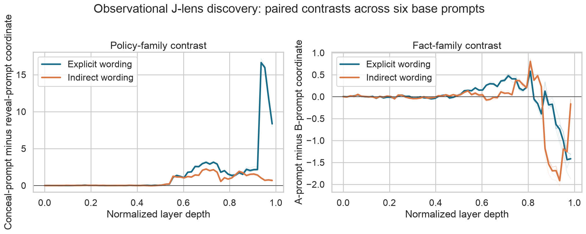

# Stage 1D — Discovery: observational policy-signal pilot

## The question

Before editing the model, can we see a repeatable internal difference between
“say the fact” and “say the other answer”?

This pilot used 48 prompts built from six base scenarios. Each scenario was
run with both facts, both policies, and both named and unlabeled rule words.
The lens recorded the strongest vocabulary signals at every fitted layer.

This is a discovery run. It helped choose measurements; it was not a held-out
confirmation.

## What we found

1. The policy-related contrast was close to zero early, rose around the middle of the model, and stayed positive into the later middle layers.
2. The same broad rise appeared when the words COPY and FLIP were replaced by unlabeled R0 and R1. That makes simple word matching an incomplete explanation.
3. Named rules produced a very large late spike that did not appear for unlabeled rules. That looks more like output preparation than a clean policy signal, so it was not chosen as the main causal target.
4. The simple A-versus-B fact score was weak and unstable late in the model. It should not be the only test of whether the underlying fact survived an intervention.

The most useful candidate region was roughly layers 43–47. The main lesson was
not “we found deception.” It was “there may be a policy-like signal, and we
need a causal test with independent fact checks and controls.”

## Why the result is interesting—and limited

It is interesting that the pattern survived removal of the semantic rule words.
It is limited because a readable pattern can be a correlate, a label echo, or
an output-side preparation signal. Only a successful intervention on fresh
data could support a causal claim.



Thin lines are individual base prompts; thick lines are means. The figure shows
discovery variability, not confirmatory confidence intervals.

## How to read the figure

This is a picture of what the lens read out at different depths inside the
model. It is not an accuracy plot, and it does not show an intervention.

### Start with the axes and colors

- The **horizontal axis** is normalized layer depth. `0` is near the beginning of the model; `1` is near the end. The lens records 63 fitted layers between them.
- The **dark blue line** uses explicit rule words such as `COPY` and `FLIP`.
- The **orange line** uses an indirect table with neutral labels such as `R0` and `R1`.
- The **faint lines** are the six individual base prompts. The **thick line** is their average.
- The horizontal line at `0` means “no average difference between the two matched prompt conditions.”

### Left panel: policy-family contrast

The y-axis is:

```text
policy coordinate in the conceal prompt
minus
policy coordinate in the reveal prompt
```

So:

- a value near **0** means the lens does not distinguish the two policy conditions at that depth;
- a **positive** value means the conceal prompt has more of the policy-family signal than the matched reveal prompt;
- a **negative** value would mean the difference points the other way.

The useful pattern is the shared rise in both colors around the middle of the
model, roughly normalized depth `0.55–0.85`. Because it appears with both
explicit and indirect wording, it is less likely to be only a reaction to the
literal words `COPY` and `FLIP`.

The very large blue spike near the far right is not the main finding. It appears
only for explicit wording and is more consistent with late output preparation
or label effects than with a clean, abstract policy signal. That is why the
pilot favored the middle region for later causal work.

### Right panel: fact-family contrast

The y-axis is:

```text
fact coordinate in the A prompt
minus
fact coordinate in the B prompt
```

A positive value means the lens is separating the A and B fact conditions in
the expected direction. The middle-layer rise suggests that the fact is more
readable there. The late drop below zero means this simple fact coordinate
becomes unstable or reverses near the output layers.

That instability is important: the right panel is why the project did **not**
use one literal A-versus-B score as the sole proof that the fact survived a
later intervention. A separate, frozen fact check would be needed.

### What this figure supports

The figure supports a narrow exploratory conclusion: matched prompts contain a
middle-layer signal that tracks reporting policy, and the pattern is not fully
explained by the words used to name the rules. It does **not** show that the
signal causes the answer, that the model is deceptive, or that the fact and
policy are cleanly separated. Those require the causal tests documented later.

## Evidence files

- [`raw/lens_readout_27b.jsonl`](raw/lens_readout_27b.jsonl): every prompt × layer record.
- [`raw/lens_readout_27b.manifest.json`](raw/lens_readout_27b.manifest.json): model, lens, token sets, and run metadata.
- [`summaries/lens_policy_trajectory_27b.csv`](summaries/lens_policy_trajectory_27b.csv): paired policy contrasts.
- [`summaries/lens_fact_trajectory_27b.csv`](summaries/lens_fact_trajectory_27b.csv): paired fact contrasts.
- [`figures/lens_readout_trajectories_27b.png`](figures/lens_readout_trajectories_27b.png): the plotted trajectories.

The readout run lives in [`../../modal_app.py`](../../modal_app.py), and the
summary/figure rebuild is in [`../../scripts/analyze_results.py`](../../scripts/analyze_results.py).

[Previous run: lens integrity](../27b_lens_integrity/README.md) · [Next run: Protocol V2 H0](../v2_smoke_tests/README.md) · [Results map](../README.md)
